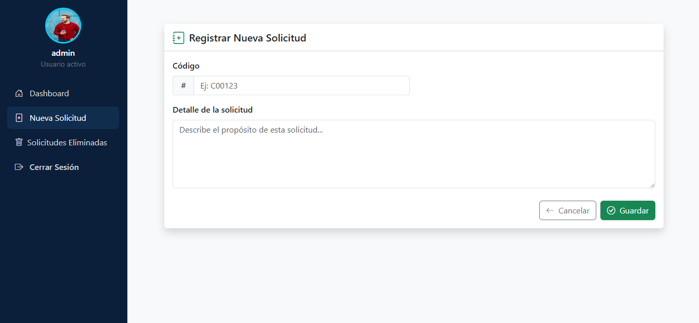
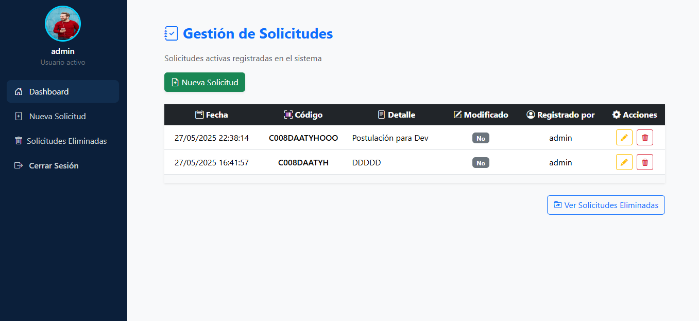
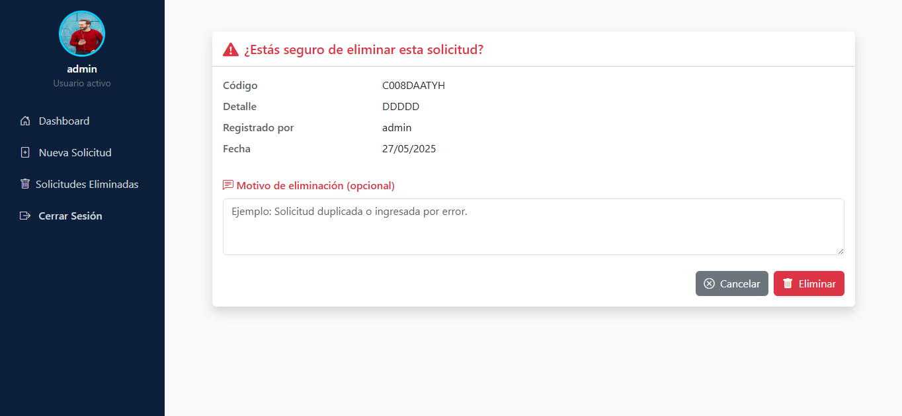
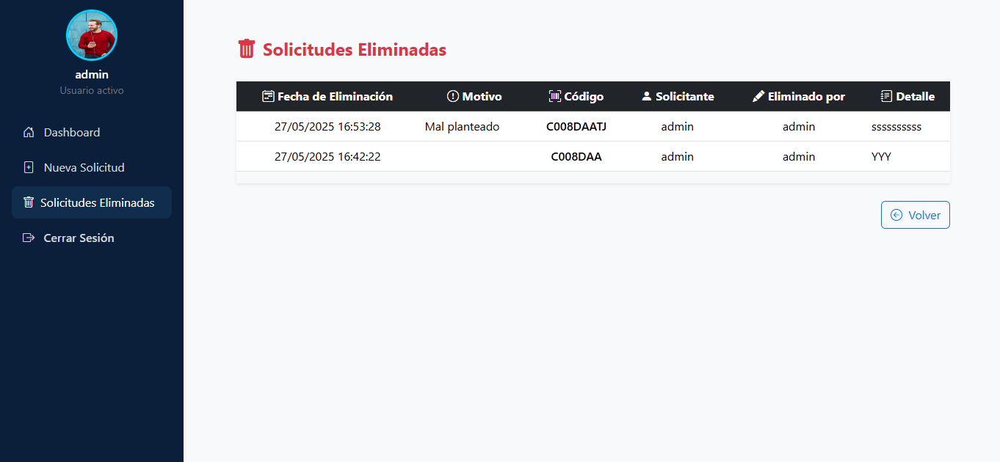
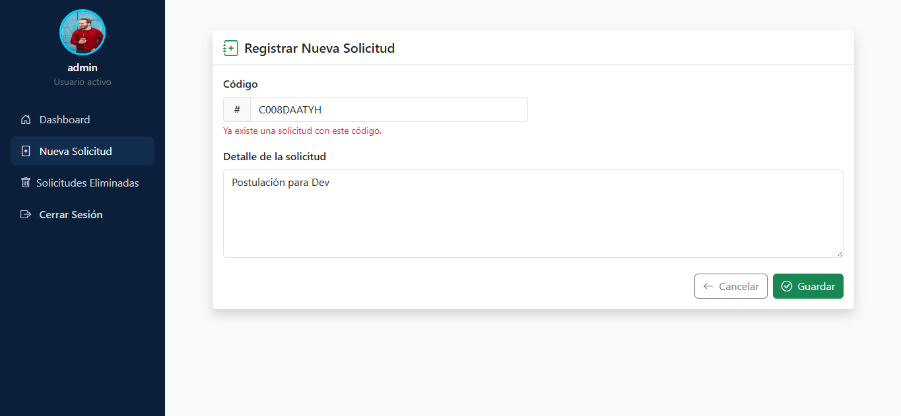

# 📦 AppWeb

**AppWeb** es una aplicación web ASP.NET Core MVC desarrollada en .NET 8.0 que permite la gestión de solicitudes con funcionalidades completas de autenticación, registro, eliminación lógica y visualización de historial.

---

## 🚀 Características Principales

- 🔐 Inicio de sesión y registro de usuarios.
- 📋 CRUD completo de solicitudes.
- 🗑️ Eliminación lógica con historial de solicitudes eliminadas.
- 🎨 Interfaz moderna y responsiva con Bootstrap 5.
- 🧭 Navegación lateral persistente.
- 🧾 Validación de formularios y manejo de errores.

---

## 🛠️ Tecnologías Usadas

- **Backend:** ASP.NET Core MVC (.NET 8)
- **Frontend:** Bootstrap 5, HTML5, Razor
- ORM Entity Framework Core (EF Core).
- **Paquetes:** Microsoft.EntityFrameworkCore.SqlServer(9.0.5) , Microsoft.EntityFrameworkCore.Tools(9.0.5) 
- **Base de datos:** SQL Server (mediante `ApplicationDbContext`)
- **Plantillas de Vista:** Razor (`.cshtml` con Tag Helpers)
- **Librerías JS:** jQuery, jQuery Validation, Bootstrap Icons

---

## 🖼️ Capturas de Pantallas de la Aplicación Web

### 🏁 CREDENCIALES DE USUARIO REGISTRADO EN LA BASE DE DATOS

- Usuario : admin
- Contraseña : admin1024*

### 🏁 Inicio de Sesión

### 🏁 Registrar Usuario

### 🏁 Dashboard

### 🏁 Creacion de Solicitud

### 📋 Solicitud Registrado

### 🆕 Eliminar Solicitud

### 🗑️ Solicitudes Eliminadas

### 🗑️ Duplicacion de Error (Crear Solicitud)
